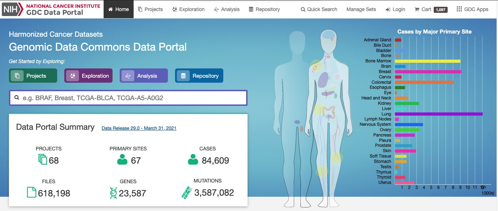
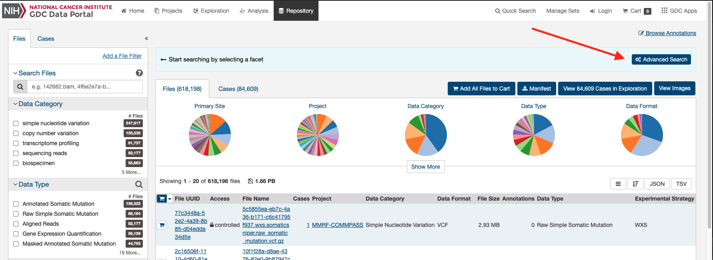
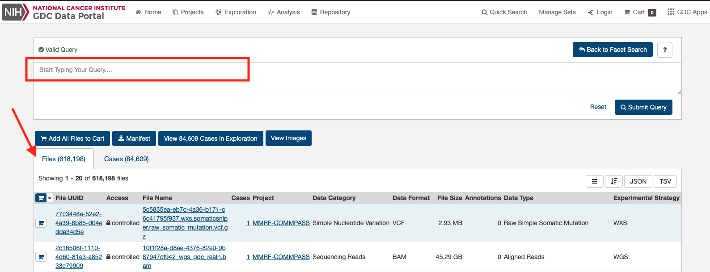
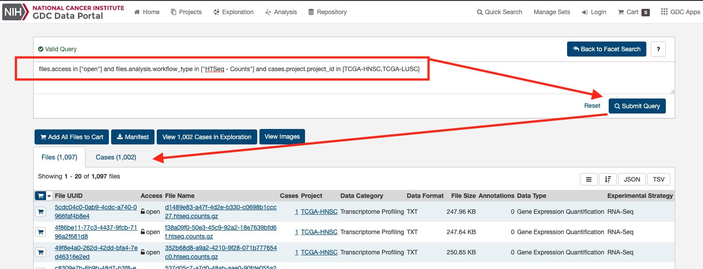
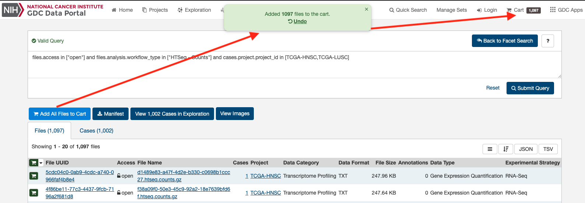
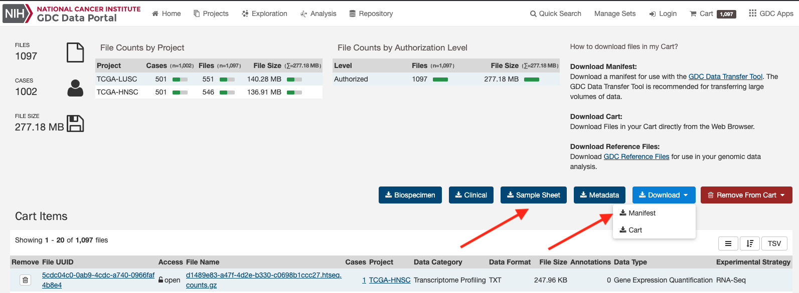
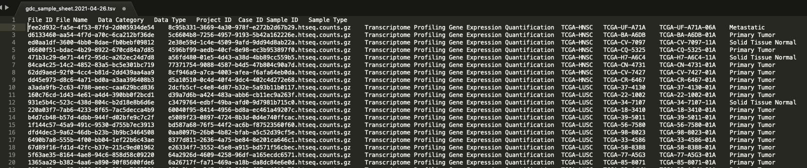
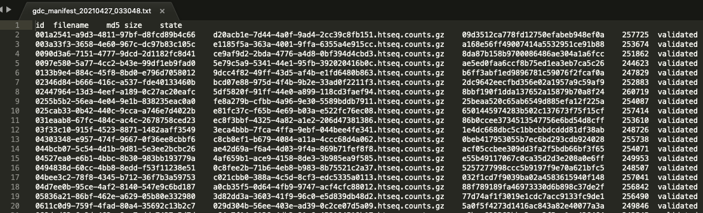
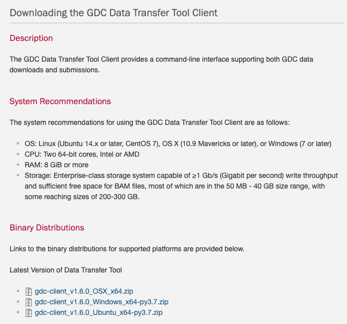

Projet: TCGA HNSC LUSC ML - Partie \#1
================
Benoit Fiset
26/04/2021

# Sélection et Téléchargement des fichiers TCGA

Les données utilisées pour ce projet seront du site du NIH - Genomic
Data Commons Data Portal qui se trouve ici:
<https://portal.gdc.cancer.gov/>

Page Principal de Genomic Data Commons Data Portal

-----

Page du “Repository” qui permet de faire sélection des fichiers
d’intérêt

-----

Il y a plusieurs méthodes pour faire le choix des fichiers à
télécharger. L’une d’elle est de faire des choix via les “click box”.

-----

Ma préféré est via une requête (query) dans “Advance Search”

-----

En utilisant la “Query”
    suivante:

    files.access in ["open"] and files.analysis.workflow_type in ["HTSeq - Counts"] and cases.project.project_id in [TCGA-HNSC,TCGA-LUSC]

Cela permet de faire un choix des fichier d’accès de type “open”
(publique) de “workflow” HTSeq-Counts des projets de TCGA-HNSC (Head and
Neck squamous cell carcinoma ) TCGA-LUSC (Lung squamous cell carcinoma)

Ce qui reste à faire est de mettre les fichiers dans le panier.

Et télécharger les fichier de “Manifest” et de “Sample Sheet” (detail
des fichiers)

Les fichiers sur le
    disque:

    -rw-r--r--@  1 bfiset  staff   153606 26 Apr 23:30 gdc_manifest_20210427_033048.txt
    -rw-r--r--@  1 bfiset  staff   218938 26 Apr 23:30 gdc_sample_sheet.2021-04-26.tsv

Exemple du fichier “Sample Sheet” qui sert à distinguer les fichiers et
qui me permettra de créer un nom unique (BarCode) qui permettra de
reconnaître la classe du fichier dans les étapes de projet.

Exemple du fichier “Manifest” qui sert de paramètre au programme client
de GDC pour faire le téléchargement des fichiers, en ligne de commande.

Le client gdc se trouve ici:
<https://gdc.cancer.gov/access-data/gdc-data-transfer-tool>

La ligne de command utilisée pour le téléchargement des fichiers est la
suivante:

    ./gdc-client download -m  gdc_manifest_20210427_033048.txt -d TCGA_Data/ -n 4

Il est important de savoir que le client gdc télécharge les fichier dans
le répertoire passé en ligne de command et que chaque fichier compressé
en .gz est dans son propre sous-répertoire.

    > tree TCGA_Data/
    TCGA_Data/
    ├── 003a33f3-3658-4e60-967c-dc97b83c105c
    │   └── e1185f5a-363a-4001-9ffa-6355a4e915cc.htseq.counts.gz
    ├── 02447964-13d3-4eef-a189-0c27ac20eafc
    │   └── 5df5820f-91ff-44e0-a899-118cd3faef94.htseq.counts.gz
    ├── 031eaab8-67fc-484c-ac4c-2678758ced23
    │   └── ec8f3bbf-4325-4a82-a1e2-206d47381386.htseq.counts.gz
    ├── 03f33c10-915f-4523-8871-1482aaff3549
    │   └── 3eca4bbb-7fca-4ffa-9ebf-044bee4fe341.htseq.counts.gz
    ├── 044bcb07-5c54-4d1b-9d81-5e3ee2bcbc26
    │   └── ae42d69a-f6a4-4d03-9f4a-869b71fef8f8.htseq.counts.gz
    ├── 0494838d-60cc-4bb8-8edd-f53f11238e51
    │   └── 0c8fee2b-71b6-4eb8-b983-8b75521c2a37.htseq.counts.gz

Un mini script bash permet facilement de tout mettre les fichiers .gz
dans un même repertoire au même niveau qui facilitera les traitement de
ces
    fichier.

    find ./TCGA_Data/ -type f \( -name "*.gz" \)|while read fname; do cp -v ${fname} ZippedFiles/. ; done

## Ceci conclut la selection de et téléchargement des fichiers qui seront utilisés lors de ce projet.
