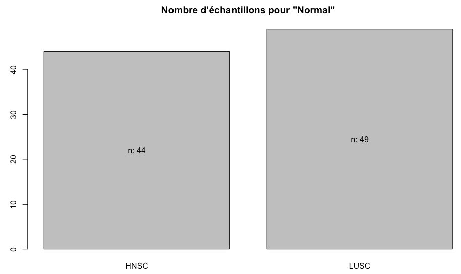

<style type="text/css">
/*https://stackoverflow.com/questions/38367392/override-rmarkdown-theme-in-order-to-change-html-page-width/38373846*/
body .main-container {
  max-width: 1100px !important;
  width: 1100px !important;
}
body {
  margin: auto;
  max-width: 1100px !important;
}
</style>
    


# Classification par apprentissage automatique du type de cancer à partir de données d'expression génétique de séquençage RNA-Seq

***

## Sur l'ordinateur personnel:

### But de la section: Filtrage, Découpe ("Training / Test sets"), Normalisation, Indice de Corrélation - Tumeurs et Normaux
```
library (DESeq2)    #VST
library(knitr)      #kable
library(tidyverse)  #purrr, reader, tibble, ...
library(FactoMineR) #PCA
library(caret)      #ML Algos
library(reshape2)   #melt
```


```r
set.seed(1234) # Important pour tjrs avoir les memes resultats
```

#### Ouverture du ficher qui regroupe tous les Tumeurs des comptes de gènes

```r
Filename <- "Tumor_Merged_2Lung_Counts.tsv"

rawCountData <- read.table(Filename, header=TRUE, row.names=1)

head(str(rawCountData))
```

```
'data.frame':	60483 obs. of  1002 variables:
 $ LUSC.56.7823.01B  : int  1988 1 1194 449 748 194 1515 2312 20363 2346 ...
 $ LUSC.33.4538.01A  : int  4640 2 3645 1189 1348 443 1593 3488 27375 2236 ...
 $ LUSC.34.2608.01A  : int  4641 0 2478 1039 480 1406 6691 4718 14515 2028 ...
 $ LUSC.XC.AA0X.01A  : int  2193 0 1702 565 338 2927 2074 2663 12626 1337 ...
 $ HNSC.BA.A4II.01A  : int  1609 1 1474 672 413 350 1180 1965 7509 2171 ...
```


```r
kable(rawCountData[1:5,498:502],"rst")
```

```
==================  ================  ================  ================  ================  ================
\                   HNSC.CV.A6JU.01A  HNSC.CR.5247.01A  HNSC.D6.6827.01A  LUSC.52.7622.01A  LUSC.60.2724.01A
==================  ================  ================  ================  ================  ================
ENSG00000000003.13              2984              1440              5457              4092              5252
ENSG00000000005.5                  2                 0                 0                 0                 1
ENSG00000000419.11              2548              2041              2258              2754              3139
ENSG00000000457.12               228               241              3026              1241               522
ENSG00000000460.15               229               297              3479               820               577
==================  ================  ================  ================  ================  ================
```


#### Filtrage des gènes qui ont plus de 95% de 0 comme compte. 

```r
percentFilterZero = 95

 # If Gene Count = 0 add 1 them sum all * 100 then / by number of columns
percentZerosCount <- 100*apply(rawCountData == 0, 1, sum) / ncol(rawCountData) 

percentZeros.df <- data.frame(PercentZero=percentZerosCount, TotalZero=apply(rawCountData == 0, 1, sum))

kable(percentZeros.df[order(-percentZeros.df$PercentZero)[2200:2210],],format = "rst")
```


#### Un exemple de genes qui sont tous a 0. Il y à 1002 echantilions et la colonne "TotalZero" qui a une valeur de 1002 montre que tous les èchantillions de ce gène sont à 0.
```
=================  ===========  =========
\                  PercentZero  TotalZero
=================  ===========  =========
ENSGR0000277120.3     100.0000       1002
ENSGR0000280767.1     100.0000       1002
ENSGR0000281849.1     100.0000       1002
ENSG00000172288.7      99.9002       1001
ENSG00000183336.7      99.9002       1001
ENSG00000189393.5      99.9002       1001
ENSG00000199231.1      99.9002       1001
ENSG00000199311.1      99.9002       1001
ENSG00000199453.1      99.9002       1001
ENSG00000199782.1      99.9002       1001
ENSG00000199870.1      99.9002       1001
=================  ===========  =========
```


#### Dans le graph suivant, des distibutions des comptes des gènes, nous pouvons voir qu'il y a beaucoup de gènes (100%) qui ont un compte de 0. Donc enlevons de la ligne rouge "95%" et plus.


```r
ggplot(data=percentZeros.df,aes(x=percentZerosCount)) +  geom_histogram(binwidth=5,color="darkblue", fill="lightblue") +
  labs(title=paste("Filter",sum(percentZerosCount >= percentFilterZero)," genes with more than",percentFilterZero,"% of zero counts"),
       x="Percent count of samples that are Zero", y = "Number of genes") + theme(plot.title = element_text(hjust = 0.5)) +
  geom_vline(xintercept = percentFilterZero, color = "red")
```


#### Filtrage des gènes qui ont moins de 1% de comptes pour tout les échantillions.

```r
# Filter Genes that have less than 1% of counts
geneMinCount = round((0.01 * ncol(rawCountData)))

# Find the Min Gene count of that Gene
minGeneCount <- apply(rawCountData, 1, min) 
```

#### Selection des gènes qui rencontrent les critères de filtrage du +95% et -1% de comptes

```r
# Create a TRUE / FALSE where TRUE is to remove that Gene
toFilterGenes <- (percentZerosCount > percentFilterZero) | (minGeneCount < geneMinCount)
```

#### La table des resultats des filtres. La colonne TRUE (ne rencontre pas les Critères de filtrage) est le nombre de gènes à enlever. La colonne FALSE (ne rencontre pas les Critèresde filtrage) est le nombre de gènes à garder

```r
table(toFilterGenes)
```
```
toFilterGenes
FALSE  TRUE 
11061 49422 
```


#### Inversion pour que TRUE = Garder gènes et FALSE = Enlever gènes 

```r
# Reverse the TRUE / FALSE to put TRUE to keep the good Genes
filteredGenes <- !toFilterGenes 
table(filteredGenes)
```
```
filteredGenes
FALSE  TRUE 
49422 11061 
```


#### Compte de gènes avant d'appliquer le filtrage 

```r
dim(rawCountData)
```
```
[1] 60483  1002
```


####  Appliquer le filtrage 

```r
# This Filters the genes that don't pass the more tnat 95% 0 and have less that 1% of counts.
cleanCountData <- rawCountData[filteredGenes, ]
```


#### Compte de gènes après le filtrage 

```r
dim(cleanCountData)
```
```
[1] 11061  1002
```
***

## Ajouter une colonne pour identifier le Type de l’échantillon.

#### Ceci est nécessaire pour l’entrainement des modèles de machine learning.

```r
# Function to return a substring, here the 4 first chars of the string sent as parameter (Ex: HNSC, LUSC)
substrColName = function(x){ substr(x,1,4) }

cleanCountDataMat <- as.matrix(cleanCountData)
kable(cleanCountDataMat[495:505,1:6],"rst")
```

#### Avant l'ajout de la colonne Type

```
==================  ================  ================  ================  ================  ================  ================
\                   LUSC.56.7823.01B  LUSC.33.4538.01A  LUSC.34.2608.01A  LUSC.XC.AA0X.01A  HNSC.BA.A4II.01A  HNSC.DQ.5629.01A
==================  ================  ================  ================  ================  ================  ================
ENSG00000051596.8               1063              1251              1551               810               750               817
ENSG00000051620.9               3886              3901              4355              3162              3095              2947
ENSG00000051825.13              1041              1741               909               664               975               789
ENSG00000052126.13              2672              3568              2285              2296              1529              3881
ENSG00000052723.10               903              1805              2416              1354              3144              1256
ENSG00000052749.12              1395              1850              2159              3150              4810              3735
ENSG00000052795.11               708               870              2507              2325              2472               931
ENSG00000052802.11              2279              4071              6115              3916              7638              3404
ENSG00000052841.13              2298              5045              4052              2555              1744              1955
ENSG00000053254.14              4926              2690              6331              3936              3270              3891
ENSG00000053371.11              1491               613              2348              1485              1817              1516
==================  ================  ================  ================  ================  ================  ================
```


```r
df.data <- data.frame(Type=apply(as.matrix(rownames(t(cleanCountDataMat))),1,substrColName), t(cleanCountDataMat) )
kable(df.data[495:505,1:6],"rst")
```

#### Après l'ajout de la colonne Type
```
================  ====  ==================  ==================  ==================  ==================  ==================
\                 Type  ENSG00000000003.13  ENSG00000000419.11  ENSG00000000457.12  ENSG00000000460.15  ENSG00000000938.11
================  ====  ==================  ==================  ==================  ==================  ==================
LUSC.22.4604.01A  LUSC                5487                1872                 919                 730                2212
LUSC.22.0940.01A  LUSC                2668                2199                1083                1421                1312
LUSC.58.A46K.01A  LUSC                1436                1974                 495                 448                 207
HNSC.CV.A6JU.01A  HNSC                2984                2548                 228                 229                 313
HNSC.CR.5247.01A  HNSC                1440                2041                 241                 297                  90
HNSC.D6.6827.01A  HNSC                5457                2258                3026                3479                 404
LUSC.52.7622.01A  LUSC                4092                2754                1241                 820                2616
LUSC.60.2724.01A  LUSC                5252                3139                 522                 577                 547
HNSC.CV.A465.01A  HNSC                1295                3827                 372                 299                 129
LUSC.21.1070.01A  LUSC                2974                2882                1097                1123                 846
LUSC.66.2781.01A  LUSC                4255                5514                1106                 697                1273
================  ====  ==================  ==================  ==================  ==================  ==================
```

***

## Découpage de des données en 80% Training et 20% Test


```r
# Percent of samples to select for training
percentForTraining = 0.8 

# Random Select percentForTraining for training DataSet
trainingDataSelect <- sample(1:nrow(df.data), size = percentForTraining * nrow(df.data))
```


```r
# Select percentForTraining for training DataSet
trainingDataset.df <- df.data[trainingDataSelect ,] 
dim(trainingDataset.df)
kable(trainingDataset.df[495:505,1:6],"rst")

# Select rest of percentForTraining for test DataSet
testDataset.df <- df.data[-trainingDataSelect ,].
dim(testDataset.df)
kable(testDataset.df[107:117,1:6],"rst")
```

***

## Normalisation avec VST de DESeq2

```
The varianceStabilizingTransformation() function calculates a variance stabilizing 
transformation (VST) from the fitted dispersion-mean relation(s) and then transforms
the count data (normalized by division by the size factors or normalization factors), 
yielding a matrix of values which are now approximately homoskedastic (having constant 
variance along the range of mean values). The transformation also normalizes with 
respect to library size. 

From: https://rdrr.io/bioc/DESeq2/man/varianceStabilizingTransformation.html
```

#### Normalisation VST (variance stabilizing transformation) du jeu Training


```r
condition <- condition <- factor(trainingDataset.df$Type)

# Transpose and Convert Training Data Frame to Matrix without the Type column
tempDDSdftoMat <- as.matrix(t(trainingDataset.df[,-1]))
coldata <- data.frame(row.names=colnames(tempDDSdftoMat), condition)

dds <- DESeqDataSetFromMatrix(countData=tempDDSdftoMat, colData=coldata, design=~condition)

data_VST <- varianceStabilizingTransformation(dds, blind = TRUE, fitType = "parametric")

vstData <- t(assay(data_VST))
trainingDataset.df <- data.frame(Type=apply(as.matrix(rownames(vstData)),1,substrColName),vstData) # Reinsert Type Column a begining
```


#### Visualisation de la projection PCA des échantillions Training


```r
pca.res <- PCA(trainingDataset.df[, -1], graph = FALSE)

vcol.set <- rep("blue", length = nrow(trainingDataset.df))
vcol.set[which(grepl("HNSC",trainingDataset.df$Type))] <- "magenta"

plot(pca.res, 
     habillage = "ind", 
     col.hab = vcol.set, graph.type = "classic",
     label = "none")
legend("topleft",
       legend = c("LUSC", 
                  "HNSC"),
       col = c("blue","magenta"), pch = 19)
```


#### Normalisation VST (variance stabilizing transformation) du jeu de Test


```r
#The variable that is used for the VST Condition is the Type column
condition <- condition <- factor(testDataset.df$Type)

# Transpose and Convert Test Data Frame to Matrix without the Type column
tempDDSdftoMat <- as.matrix(t(testDataset.df[,-1]))   
coldata <- data.frame(row.names=colnames(tempDDSdftoMat), condition)

# Import the Counts matrix in the dds ofject
dds <- DESeqDataSetFromMatrix(countData=tempDDSdftoMat, colData=coldata, design=~condition)

#Perform tht VST normalisation 
data_VST <- varianceStabilizingTransformation(dds, blind = TRUE, fitType = "parametric")

#Extract teh assay out of the DESeq2 S4 structure
vstData <- t(assay(data_VST))

# Reinsert Type Column at begining
testDataset.df <- data.frame(Type=apply(as.matrix(rownames(vstData)),1,substrColName),vstData) 
```

#### Visualisation de la projection PCA des échantillions Test


```r
pca.res <- PCA(testDataset.df[, -1], graph = FALSE)

vcol.set <- rep("blue", length = nrow(testDataset.df))
vcol.set[which(grepl("HNSC",testDataset.df$Type))] <- "magenta"

plot(pca.res, 
     habillage = "ind", 
     col.hab = vcol.set, graph.type = "classic",
     label = "none")
legend("topleft",
       legend = c("LUSC", 
                  "HNSC"),
       col = c("blue","magenta"), pch = 19)
```


***

## Filtrage des échantillons qui ont un coefficient de corrélation de plus de 98% du jeu Training


```r
# Remove the highly correlated genes in the training set
correlationCutOff = 0.97 # Remove greater than this value (This is NOT ">=" it's ">" )
correlationMatrix <- cor(subset(trainingDataset.df, select = -Type))
correlationMatrix <- round(correlationMatrix,2)
highlyCorrelated = findCorrelation(correlationMatrix, cutoff=correlationCutOff,names=TRUE, verbose=TRUE, exact = FALSE)
```

```
 Combination row 24 and column 2346 is above the cut-off, value = 0.98 
 	 Flagging column 24 
 Combination row 2540 and column 7376 is above the cut-off, value = 0.98 
 	 Flagging column 2540 
 Combination row 6758 and column 8429 is above the cut-off, value = 0.98 
 	 Flagging column 6758 
 Combination row 8429 and column 8430 is above the cut-off, value = 0.98 
 	 Flagging column 8430 
```


```r
print(highlyCorrelated)
```

#### Ceci sont les gènes hautement corrélées. La fonction findCorrelation ne donne que le resulat final des ses choix.

```
[1] "ENSG00000173372.15" "ENSG00000002933.6"  "ENSG00000108821.12" "ENSG00000159189.10"
```
#### Validation des résultats de la fonction findCorrelation en réduisant la dimension de la matrice de corrélation et en faisant une recherche des valeurs (X > 0.97 & X != 1). Donc 98% et pas lui-même (1) 

```r
# melt the coreelation matrix to a smaller dimension data frame - easier for the sanity of the user !
meltCorrelationMatrix <- melt(correlationMatrix)
validCorrelationMatrix <-meltCorrelationMatrix[((meltCorrelationMatrix$value > correlationCutOff)&(meltCorrelationMatrix$value != 1)),] # Ex: find (X > 0.97 & X != 1)
validCorrelationMatrix <- droplevels(validCorrelationMatrix)
print(validCorrelationMatrix)
```


#### Cette méthode de validation montre au moins les noms des gènes corrélées et les autres options qui auraient été possible d’enlever.
```
                       Var1               Var2 value
256749   ENSG00000106565.16  ENSG00000002933.6  0.98
25938069  ENSG00000002933.6 ENSG00000106565.16  0.98
28091255 ENSG00000164692.16 ENSG00000108821.12  0.98
74747606 ENSG00000173369.14 ENSG00000159189.10  0.98
81577415 ENSG00000108821.12 ENSG00000164692.16  0.98
93228866 ENSG00000159189.10 ENSG00000173369.14  0.98
93230538 ENSG00000173372.15 ENSG00000173369.14  0.98
93241598 ENSG00000173369.14 ENSG00000173372.15  0.98
```

#### Nombre d'échantillons avant d'enlever les gènes hautement corrélés

```r
dim(trainingDataset.df)
```
```
[1]   801 11062
```

#### Enlever / filtrer les gènes de plus de 98% de corrélation.

```r
trainingDataset.df <- trainingDataset.df[ , ! names(trainingDataset.df) %in% highlyCorrelated ] 
```

#### Nombre d'échantillons après avoir enlevé les gènes hautement corrélées


```r
dim(trainingDataset.df)
```
```
[1]   801 11058
```

#### Visualisation de la projection PCA des échantillions pour savoir si le filtrage de corrélation a fait des changements


***

## Compte final

### Décompte des échantillons qui serviront pour l’entrainement et les tests des modèles du projet par type d'échantillion


```r
par(mfrow=c(2,1))
my.barplot <- barplot(table(trainingDataset.df[,"Type"]), main='Nombre d’échantillons pour "Training"')
text(my.barplot,(table(trainingDataset.df$Type)/2), paste("n: ", table(trainingDataset.df$Type), sep="") ,cex=1) 

my.barplot <- barplot(table(testDataset.df[,"Type"]), main='Nombre d’échantillons pour "Test"')
text(my.barplot,(table(testDataset.df$Type)/2), paste("n: ", table(testDataset.df$Type), sep="") ,cex=1) 

par(mfrow=c(1,1))
```


***
# Filtrage et normalisation VST du jeu de test normale.

#### Voici le code "directe" avec un minimums de sorties et explications.  


```r
Filename <- "Normal_Merged_2Lung_Counts.tsv"
rawCountData <- read.table(Filename, header=TRUE, row.names=1)
percentFilterZero = 95
percentZerosCount <- 100*apply(rawCountData == 0, 1, sum) / ncol(rawCountData) # If Gene Count = 0 add 1 them sum all * 100 then / by number of columns 

percentZeros.df <- data.frame(PercentZero=percentZerosCount, TotalZero=apply(rawCountData == 0, 1, sum))

# Filter Genes that have less than 1% of counts
geneMinCount = round((0.01 * ncol(rawCountData)))

# Find the Min Gene count of that Gene
minGeneCount <- apply(rawCountData, 1, min)

# Create a TRUE / FALSE where TRUE is to remove that Gene
toFilterGenes <- (percentZerosCount > percentFilterZero) | (minGeneCount < geneMinCount) 

# Reverse the TRUE / FALSE to put TRUE to keep the good Genes
filteredGenes <- !toFilterGenes 

print(table(filteredGenes))
```
```
filteredGenes
FALSE  TRUE 
43057 17426 
```

```r
print (dim(rawCountData))
```
```
[1] 60483    93
```

```r
# This Filters the genes that don't pass the more tnat 95% 0 and have less that 1% of counts.
cleanCountData <- rawCountData[filteredGenes, ]
```

```r
print (dim(cleanCountData))
```
```
[1] 60483    93
```

```r
# Function to return a substring, here the 4 first chars of the string sent as parameter (Ex: HNSC, LUSC)
substrColName = function(x){ substr(x,1,4) }

cleanCountDataMat <- as.matrix(cleanCountData)
# kable(cleanCountDataMat[1:10,43:47],"rst")

# Crate dataframe and Type column
df.data <- data.frame(Type=apply(as.matrix(rownames(t(cleanCountDataMat))),1,substrColName), t(cleanCountDataMat) )

#kable(df.data[40:49,1:6],"rst")
```


```r
#DESeq2 VST Normalization - Normale
normalDataset.df <- df.data

condition <- condition <- factor(normalDataset.df$Type)
tempDDSdftoMat <- as.matrix(t(normalDataset.df[,-1]))   # Transpose and Convert Normal Data Frame to Matrix without the Type column
coldata <- data.frame(row.names=colnames(tempDDSdftoMat), condition)

dds <- DESeqDataSetFromMatrix(countData=tempDDSdftoMat, colData=coldata, design=~condition)

data_VST <- varianceStabilizingTransformation(dds, blind = TRUE, fitType = "parametric")

vstData <- t(assay(data_VST))
# Reinsert Type Column a begining
normalDataset.df <- data.frame(Type=apply(as.matrix(rownames(vstData)),1,substrColName),vstData) 
```

#### Visualisation de la projection PCA des échantillions Normale


```r
pca.res <- PCA(normalDataset.df[, -1], graph = FALSE)

vcol.set <- rep("blue", length = nrow(normalDataset.df))
vcol.set[which(grepl("HNSC",normalDataset.df$Type))] <- "magenta"

plot(pca.res, 
     habillage = "ind", 
     col.hab = vcol.set, graph.type = "classic",
     label = "none")
legend("topleft",
       legend = c("LUSC", 
                  "HNSC"),
       col = c("blue","magenta"), pch = 19)
```


### Décompte des échantillons normaux qui serviront pour tester les modèles du projet.


```r
par(mfrow=c(2,1))
my.barplot <- barplot(table(normalDataset.df[,"Type"]), main='Nombre d’échantillons pour "Normale"')
text(my.barplot,(table(normalDataset.df$Type)/2), paste("n: ", table(normalDataset.df$Type), sep="") ,cex=1) 
par(mfrow=c(1,1))
}
```



***
***

### Changer les noms des jeux de données Training et Test pour des noms qui reflète leur contenu.

```r
trainingDataset.df_VST <- trainingDataset.df
testDataset.df_VST <- testDataset.df
normalDataset.df_VST <- normalDataset.df
```

***
***
## Bonus

#### Autre code qui a été utilisé pour faire un autre type de normalisation (log naturel) des données qui ont été utilisées pour une expérience parelle de comparaison des performances de 6 algorithmes de machine learning. Fait pour jeu Training et Test. Ceci remplaçait la normalisation VST dans le workflow (voir plus haut). Note: pas fait pour le jeu de test Normale.


```r
trainingDataset.df <- log(trainingDataset.df[,-1]) # Normalize without the Type Column
substrColName = function(x){ substr(x,1,4) }   # Need This function for apply in next line
trainingDataset.df <- cbind(Type=apply(as.matrix(rownames(trainingDataset.df)),1,substrColName),trainingDataset.df)

testDataset.df <- log(testDataset.df[,-1]) # Normalize without the Type Column
substrColName = function(x){ substr(x,1,4) }   # Need This function for apply in next line
testDataset.df <- cbind(Type=apply(as.matrix(rownames(testDataset.df)),1,substrColName),testDataset.df)
```

### Changer les noms des jeux de données Training et Test pour des noms qui reflète leur contenu.


```r
trainingDataset.df_Log <- trainingDataset.df
testDataset.df_Log <- testDataset.df
```


***

## Fin section Filtrage, Découpe ("Training / Test sets"), Normalisation, Indice de Corrélation - Tumeurs et Normaux
