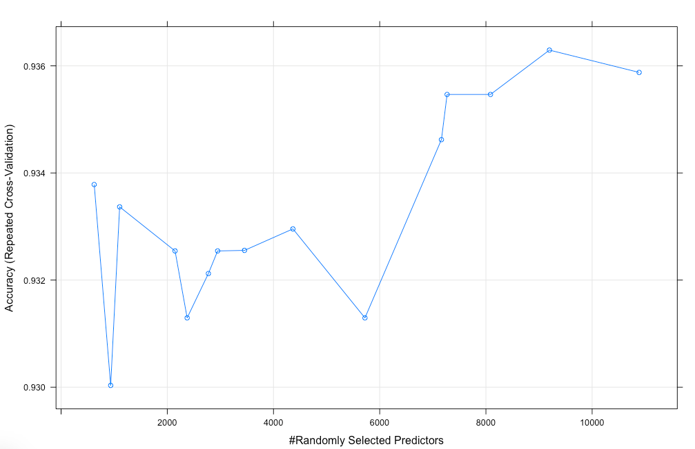

<style type="text/css">
/*https://stackoverflow.com/questions/38367392/override-rmarkdown-theme-in-order-to-change-html-page-width/38373846*/
body .main-container {
  max-width: 1100px !important;
  width: 1100px !important;
}
body {
  margin: auto;
  max-width: 1100px !important;
}
</style>


# Classification par apprentissage automatique du type de cancer à partir de données d'expression génétique de séquençage RNA-Seq

***

### But de la section : Entrainement des modèles de machine learning. 
### Pour le projet les algorithmes de prediction **SVM** et **randomForest** seront utilisés apres un test de sélection.

### Sur serveur HPC:
```
library(knitr)      # kable
library(doParallel)
library(caret)      # caret (Classification And REgression Training) - creating predictive models
library(randomForest)
library(kernlab)    # SVM
```

```r
# Important pour tjrs avoir les memes resultats

set.seed(1234) 
```
***
# Notes:
```
J'ai fait le choix du package R caret (Classification And REgression Training) pour les 
modèles de prédictions pour ce projet. Il en existe d’autres comme e1071 (interface R à libsvm)
et kernlab (kvsm) pour des SVM. 

L’avantage de caret et qu’il fait déjà interface « under the hood » avec les package kernlab, e1071,
randomForest et 236 autre outils de régression et classification et le tout configurable dépendant
du modèle et méthode choisi. C'est vraiment un "couteau suisse" pour créer des modèles de prédictions.
```
***
#### Initialisation des « worker services » 

Ceci permet l’entrainement des modèles pour bénéficier du parallélisme des serveurs haute performance. L’utilisation de 32 CPU aide énormément à réduire le temps nécessaire pour entrainer les modèles. 

Exemple, avec 32 CPU, l’entrainement de Random Forest prends presque 2 heures. Lorsque essayé avec ordinateur personnel, en utilisant l’équivalent de 5 CPU, l’entrainement n’était pas fini après 18 heures de calculs !!


```r
set.seed(1234)
cl <- makeCluster(32, type='PSOCK', outfile="OutCaret.txt")
registerDoParallel(cl)
```

Une des forces du package caret et de pouvoir directement influencer l’entrainement du modèleavec des paramètres d‘optimisation dès le début.  Ceci veut dire que qu’au lieu de débuter avec les paramètres de base pour le premier entrainement et plus tard essayer d’optimiser les performances, nous pouvons déjà dès le début dire au model d’essayer de trouver le meilleur modèle de prédiction en utilisant des variances des métriques d’influences.

La fonction de caret qui permet cela est trainControl() qui génère les paramètres qui permettent de contrôler comment les modèles optimisés sont créés.  Des options possibles dont des « bootstrap », « K-fold cross-validation », « Leave One Out cross-validation, « Repeated K-fold cross-validation », etc..


Dans le projet j’ai choisi de faire l’optimisation avec « CV » qui est « K-fold cross-validation » avec un nombre de « 10 » qui control le nombre de « folds ».

Vu un assez grand nombre d’échantillons la métrique « Accuracy » a été choisi au lieu de « Kappa » pour la métrique de classification de l’entrainement du modèle. 


```r
# Run algorithms using 10-fold cross validation
control <- trainControl(method="cv", number=10, allowParallel = TRUE, verboseIter = TRUE)
metric <- "Accuracy"
```


## Comparaison des performances de 6 algorithmes de ML avec des différentes normalisations des données


J'ai fait des tests de comparaison avec 6 modèles de classifications pour faire un choix pour le projet. J’ai toujours pris les mêmes jeux de données avec les mêmes des traitements de filtrage ( 95% de comptes de valeur 0, moins de 1% de comptes, indice de corrélation de plus de 98%) mais avec une différence: la normalisation. 

Il y a eu 3 rondes d’entrainement pour les 6 modèles :

* Une avec les données NON normalises (« raw RNAseq counts)
* Une avec les données normalises avec la fonction R Log() = Logarithme Naturel
  * "Bonus" de la section 3
* Une avec les données normalises avec la fonction VST de DESeq2 (Section 3)


```r
# a) Algo linéaire
#
# lda = Linear Discriminant Analysis
set.seed(1234)
fitlda     <- caret::train(Type~., data=trainingDataset.df , method="lda", metric=metric, trControl=control)
fitlda_Log <- caret::train(Type~., data=trainingDataset.df_Log , method="lda", metric=metric, trControl=control)
fitlda_VST <- caret::train(Type~., data=trainingDataset.df_VST , method="lda", metric=metric, trControl=control)

# b) Algo Non linéaire
#
# Famiile CART (Classification And Regression Tree) de caret
#   Fonction rpart = Recursive Partitioning and Regression Trees
set.seed(1234)
fitcart     <- caret::train(Type~., data=trainingDataset.df , method="rpart", metric=metric, trControl=control)
fitcart_Log <- caret::train(Type~., data=trainingDataset.df_Log , method="rpart", metric=metric, trControl=control)
fitcart_VST <- caret::train(Type~., data=trainingDataset.df_VST , method="rpart", metric=metric, trControl=control)

# kNN = k-Nearest Neighbors
set.seed(1234)
fitknn     <- caret::train(Type~., data=trainingDataset.df , method="knn", metric=metric, trControl=control)
fitknn_Log <- caret::train(Type~., data=trainingDataset.df_Log , method="knn", metric=metric, trControl=control)
fitknn_VST <- caret::train(Type~., data=trainingDataset.df_VST , method="knn", metric=metric, trControl=control)

# c) Algos plus advancè
#
# svmRadial =Support Vector Machines with Radial Basis Function Kernel
set.seed(1234)
fitsvmRadial     <- caret::train(Type~., data=trainingDataset.df , method="svmRadial", metric=metric, trControl=control)
fitsvmRadial_Log <- caret::train(Type~., data=trainingDataset.df_Log , method="svmRadial", metric=metric, trControl=control)
fitsvmRadial_VST <- caret::train(Type~., data=trainingDataset.df_VST , method="svmRadial", metric=metric, trControl=control)

# svmLinear = Support Vector Machines with Linear Kernel
set.seed(1234)
fitsvmLinear     <- caret::train(Type~., data=trainingDataset.df , method='svmLinear', metric=metric, trControl=control)
fitsvmLinear_Log <- caret::train(Type~., data=trainingDataset.df_Log , method='svmLinear', metric=metric, trControl=control)
fitsvmLinear_VST <- caret::train(Type~., data=trainingDataset.df_VST , method='svmLinear', metric=metric, trControl=control)

# rf = Random Forest
set.seed(1234)
fitrf      <- caret::train(Type~., data=trainingDataset.df , method="rf", metric=metric, trControl=control, verbose = TRUE)
fitrf_Log  <- caret::train(Type~., data=trainingDataset.df_Log , method="rf", metric=metric, trControl=control, verbose = TRUE)
fitrf_VST  <- caret::train(Type~., data=trainingDataset.df_VST , method="rf", metric=metric, trControl=control, verbose = TRUE)
```

#### Agrégation et affichage des résultats des tests de comparaison avec fonction resamples()


```r
results <- resamples(list(lda=fitlda,lda_Log=fitlda_Log,lda_VST=fitlda_VST, cart=fitcart, cart_Log=fitcart_Log,
          cart_VST=fitcart_VST, knn=fitknn,knn_Log=fitknn_Log,knn_VST=fitknn_VST,svmRadial=fitsvmRadial,
          svmRadial_Log=fitsvmRadial_Log,svmRadial_VST=fitsvmRadial_VST, svmLinear=fitsvmLinear,
          svmLinear_Log=fitsvmLinear_Log,svmLinear_VST=fitsvmLinear_VST, rf=fitrf,rf_Log=fitrf_Log, 
          rf_VST=fitrf_VST))

summary(results)
```
```
Call:
summary.resamples(object = results)

Models: lda, lda_Log, lda_VST, cart, cart_Log, cart_VST, knn, knn_Log, knn_VST, svmRadial, 
svmRadial_Log, svmRadial_VST, svmLinear, svmLinear_Log, svmLinear_VST, rf, rf_Log, rf_VST 

Number of resamples: 10 

Accuracy 
                   Min.   1st Qu.    Median      Mean   3rd Qu.      Max. NA's
lda           0.9125000 0.9412037 0.9685918 0.9563264 0.9750000 0.9875000    0
lda_Log       0.9625000 0.9780854 0.9875000 0.9837650 0.9876157 1.0000000    0
lda_VST       0.9625000 0.9750000 0.9875000 0.9824992 0.9876157 1.0000000    0
cart          0.7375000 0.8255401 0.8323302 0.8352422 0.8495253 0.9125000    0
cart_Log      0.7375000 0.8255401 0.8323302 0.8352422 0.8495253 0.9125000    0
cart_VST      0.8227848 0.8406250 0.8750000 0.8638063 0.8843750 0.8888889    0
knn           0.8000000 0.8485759 0.8687500 0.8700107 0.8885417 0.9506173    0
knn_Log       0.9000000 0.9127701 0.9245253 0.9262940 0.9343750 0.9753086    0
knn_VST       0.9000000 0.9250000 0.9316358 0.9338102 0.9498418 0.9629630    0
svmRadial     0.9125000 0.9369066 0.9437500 0.9474826 0.9597222 0.9876543    0
svmRadial_Log 0.9500000 0.9530063 0.9625000 0.9662488 0.9752315 0.9876543    0
svmRadial_VST 0.9500000 0.9621440 0.9689043 0.9712488 0.9875000 0.9876543    0
svmLinear     0.9500000 0.9531250 0.9625000 0.9662805 0.9752315 0.9876543    0
svmLinear_Log 0.9625000 0.9750000 0.9875000 0.9824992 0.9876157 1.0000000    0
svmLinear_VST 0.9620253 0.9781250 0.9875000 0.9824834 0.9876157 1.0000000    0
rf            0.9000000 0.9250000 0.9317130 0.9363727 0.9500000 0.9746835    0
rf_Log        0.9000000 0.9250000 0.9317130 0.9363260 0.9500000 0.9753086    0
rf_VST        0.9125000 0.9187500 0.9378858 0.9400760 0.9623813 0.9629630    0

Kappa 
                   Min.   1st Qu.    Median      Mean   3rd Qu.      Max. NA's
lda           0.8245614 0.8825499 0.9371938 0.9126176 0.9500312 0.9749687    0
lda_Log       0.9250000 0.9561322 0.9749844 0.9675078 0.9751890 1.0000000    0
lda_VST       0.9250000 0.9499687 0.9749844 0.9649750 0.9751890 1.0000000    0
cart          0.4716981 0.6501503 0.6652746 0.6695214 0.6977937 0.8243413    0
cart_Log      0.4716981 0.6501503 0.6652746 0.6695214 0.6977937 0.8243413    0
cart_VST      0.6429955 0.6804040 0.7492163 0.7265439 0.7679974 0.7772686    0
knn           0.5977373 0.6962417 0.7367309 0.7393602 0.7768661 0.9014599    0
knn_Log       0.7998749 0.8251914 0.8485060 0.8522640 0.8684205 0.9504587    0
knn_VST       0.7998749 0.8497182 0.8630833 0.8673280 0.8993139 0.9258920    0
svmRadial     0.8243413 0.8731380 0.8872650 0.8946446 0.9193721 0.9752521    0
svmRadial_Log 0.8998121 0.9058833 0.9248591 0.9323767 0.9504564 0.9752521    0
svmRadial_VST 0.8998121 0.9239935 0.9377730 0.9424018 0.9749687 0.9752521    0
svmLinear     0.8998121 0.9061796 0.9250000 0.9324843 0.9503886 0.9752973    0
svmLinear_Log 0.9250000 0.9499217 0.9749844 0.9649687 0.9751890 1.0000000    0
svmLinear_VST 0.9238677 0.9562187 0.9749844 0.9649323 0.9751890 1.0000000    0
rf            0.7991212 0.8495769 0.8631675 0.8724097 0.8999061 0.9491961    0
rf_Log        0.7991212 0.8495298 0.8631675 0.8723097 0.8999061 0.9505495    0
rf_VST        0.8241206 0.8372574 0.8757434 0.8798831 0.9245392 0.9257562    0
```


Avec la vue suivante de tous les lignes et 7 premières colonnes (de 37) des résultats de comparaison, nous pouvons voir qu’il y a bien eu « 10 folds » de la « K-fold cross-validation » pour chaque modèle de classification testé.


```r
kable(results$values[,1:7],"rst")
```
```
========  ============  =========  ================  =============  ================  =============
Resample  lda~Accuracy  lda~Kappa  lda_Log~Accuracy  lda_Log~Kappa  lda_VST~Accuracy  lda_VST~Kappa
========  ============  =========  ================  =============  ================  =============
Fold01       0.9125000  0.8247810         0.9625000      0.9250000         0.9625000      0.9250000
Fold02       0.9746835  0.9492940         0.9873418      0.9746226         0.9746835      0.9492940
Fold03       0.9382716  0.8767123         0.9876543      0.9752521         0.9876543      0.9752521
Fold04       0.9753086  0.9506399         0.9876543      0.9752973         0.9876543      0.9752973
Fold05       0.9625000  0.9250936         1.0000000      1.0000000         1.0000000      1.0000000
Fold06       0.9500000  0.9000625         0.9875000      0.9750000         0.9875000      0.9750000
Fold07       0.9750000  0.9500312         0.9875000      0.9750000         0.9875000      0.9750000
Fold08       0.9750000  0.9500312         0.9750000      0.9499687         0.9750000      0.9499687
Fold09       0.9875000  0.9749687         0.9875000      0.9749687         0.9875000      0.9749687
Fold10       0.9125000  0.8245614         0.9750000      0.9499687         0.9750000      0.9499687
========  ============  =========  ================  =============  ================  =============
```

#### Un beau boxplot plus gentil pour l'oeil que des colonnes de chiffres pour les resultats 


```r
scales <- list(x=list(relation="free"), y=list(relation="free"))
bwplot(results, scales=scales)
```


Nous pouvons constater par ces résultats de test de comparaison d’entrainement que le modèles svmLinear et lda avec normalisation VST et Log sont les plus précis des tests (98%). Je dirais même qu'ils sont presque identiques…. Ça se joue loin dans les petites décimales !

Donc pour le projet de vais choisir « svmLinear » avec normalisation VST et un du milieu du peloton « rf » avec normalisation VST (94%) et essayer d’améliorer ses résultats en modifiant ses paramètres. 

***

## Code et resultats que pour svmLinear_VST (svm "linear kernel" et normalisation VST)


```r
#Le "seed" du nombre aléatoire garantit que les résultats sont directement comparables.
set.seed(1234)
fitsvmLinear_VST <- caret::train(Type~., data=trainingDataset.df_VST , method='svmLinear', metric=metric, trControl=control)
print(fitsvmLinear_VST)
```

```
Support Vector Machines with Linear Kernel 

  801 samples
11057 predictors
    2 classes: 'HNSC', 'LUSC' 

No pre-processing
Resampling: Cross-Validated (10 fold) 
Summary of sample sizes: 721, 722, 720, 720, 721, 721, ... 
Resampling results:

  Accuracy   Kappa    
  0.9824834  0.9649323

Tuning parameter 'C' was held constant at a value of 1
```

## Comme mentionné à la sélection du model le svmLinear_VST a une précision de 98% au final


#### Voir les paramètres du modèle final SVM.


```r
print(fitsvmLinear_VST$finalModel)
```
```
Support Vector Machine object of class "ksvm" 

SV type: C-svc  (classification) 
 parameter : cost C = 1 

Linear (vanilla) kernel function. 

Number of Support Vectors : 201 

Objective Function Value : -0.0118 
Training error : 0 
```


Il serait intéressant de voir les « gènes » qui influence le plus le modèle entrainé mais les SVM n’ont pas de score d’importance.  

Pour les modèles où aucun score d'importance est intégré, implémenté ou n'existe pas, la fonction varImp() de caret peut être utilisé pour obtenir des scores. 

Pour les modèles de classification SVM, le processus par défaut consiste à calculer l'aire sous la courbe ROC (receiver operating characteristic curve) pour aider à démontrer les performances de classification du modèle.

L'importance (%) quantifie seulement l'impact du prédicteur, pas l'effet spécifique.


```r
rocImpfitSVM <- varImp(fitsvmLinear_VST, scale = FALSE)
print(rocImpfitSVM)
```

```
ROC curve variable importance

  only 20 most important variables shown (out of 11057)

                   Importance
ENSG00000175416.11     0.9186
ENSG00000116871.14     0.9161
ENSG00000188522.13     0.9085
ENSG00000160789.18     0.9052
ENSG00000105355.7      0.9031
ENSG00000175793.11     0.9001
ENSG00000168398.6      0.8786
ENSG00000164086.9      0.8728
ENSG00000162302.11     0.8727
ENSG00000183111.10     0.8726
ENSG00000133460.18     0.8722
ENSG00000184363.8      0.8701
ENSG00000178951.7      0.8695
ENSG00000129250.10     0.8685
ENSG00000167114.11     0.8674
ENSG00000186081.10     0.8665
ENSG00000129219.12     0.8631
ENSG00000174791.9      0.8631
ENSG00000127824.12     0.8625
ENSG00000068912.12     0.8622
```

#### En graphique


```r
plot(rocImpfitSVM, top = 20)
```


***

## Code et resultats que pour fitrf_VST (Random Forest et normalisation VST)


```r
#Le "seed" du nombre aléatoire garantit que les résultats sont directement comparables.
set.seed(1234)
fitrf_VST  <- caret::train(Type~., data=trainingDataset.df_VST , method="rf", metric=metric, trControl=control, verbose = TRUE)
print(fitrf_VST)
```
```
Random Forest 

  801 samples
11057 predictors
    2 classes: 'HNSC', 'LUSC' 

No pre-processing
Resampling: Cross-Validated (10 fold) 
Summary of sample sizes: 721, 722, 720, 720, 721, 721, ... 
Resampling results across tuning parameters:

  mtry   Accuracy   Kappa    
      2  0.9213410  0.8422526
    148  0.9325756  0.8648155
  11057  0.9400760  0.8798831

Accuracy was used to select the optimal model using the largest value.
The final value used for the model was mtry = 11057.
```
## Comme mentionné à la sélection du model le fitrf_VST a une précision de 94% au final

#### Voir les paramètres du modèle final RF.


```r
print(fitrf_VST$finalModel)
```
```
Call:
 randomForest(x = x, y = y, mtry = param$mtry, verbose = TRUE) 
               Type of random forest: classification
                     Number of trees: 500
No. of variables tried at each split: 11057

        OOB estimate of  error rate: 6.49%
Confusion matrix:
     HNSC LUSC class.error
HNSC  353   36  0.09254499
LUSC   16  396  0.03883495
```

Il serait intéressant aussi de voir les « gènes » qui influence le plus le modèle RF entrainé. Comme pour le SVM. Ayant pas mis le pramametre importance=TRUE lors de l'entrainement je le fais apres coup.

Note: La valeur d'importance de Random Forest est une mesure agrégée. (d'ou qu'une valeur de plus que 100 est possible). Cette valeur quantifie seulement l'impact du prédicteur, pas l'effet spécifique.


```r
rocImpfitrf_VST <- varImp(fitrf_VST, scale = FALSE)
print(rocImpfitrf_VST)
```
```
rf variable importance

  only 20 most important variables shown (out of 11057)

                   Overall
ENSG00000116871.14 105.105
ENSG00000105355.7   36.896
ENSG00000175416.11  36.040
ENSG00000175793.11  24.687
ENSG00000160789.18   9.573
ENSG00000197249.11   9.014
ENSG00000196544.7    6.394
ENSG00000006744.17   5.965
ENSG00000123080.9    4.803
ENSG00000188522.13   4.107
ENSG00000082014.15   3.752
ENSG00000163995.17   2.575
ENSG00000119318.11   2.496
ENSG00000198759.10   2.432
ENSG00000150540.12   2.095
ENSG00000151881.13   1.933
ENSG00000131471.5    1.855
ENSG00000050555.16   1.685
ENSG00000145911.5    1.323
ENSG00000132361.15   1.244
```

#### En graphique


```r
plot(rocImpfitrf_VST, top = 20, col="red")
```


#### Avec les données côte à côte, nous pouvons voir que les 6 top valeurs d’importance des deux modèles se retrouvent dans les deux


***

## Essayons d’améliorer la précision du modèle fitrf_VST pour avoir une précision de plus que 94% avec les paramètres trainControl() de caret.

Au lieu de prendre le « K-fold cross-validation » je vais essayer avec « Repeated K-fold cross-validation » qui a un paramètre de plus : « repeats » qui permet de refaire le « K-fold cross-validation » un certain nombre de fois.  

Le package caret permet de chercher les hyperparamètres d’optimisation au hasard. Il permet 2 styles : le premier, complètement au hasard (search=random) ou le deuxième au hasard mais d’une grille de valeurs donnée (search=grid). Je vais faire les 2 méthodes. Ceci est le paramètre « search » de la fonction caret ::trainControl()

Le modèle Random Forest utilise le paramètre « mtry » comme variable pour se raffiner. Cette variable permet de choisir le nombre de variables échantillonnées aléatoirement comme 
candidats à chaque division de l’arbre de décision. Pour (search=grid) il faut donner un grille de valeurs. Ceci est fait avec la structure « tunegrid » qui est utilisé par le paramètre « tuneGrid » de la fonction caret ::train().

### Méthode: Grid Search

```
Note: Cette section de code, avec 32 CPU prends un peu moins de 3 heures de calcul 
```

```r
# Grid Search
set.seed(1234)
cl <- makeCluster(32, type='PSOCK', outfile="OutCaret.txt")
registerDoParallel(cl)

control <- trainControl(method="repeatedcv", number=10, repeats=3, search="grid", allowParallel = TRUE)
metric <- "Accuracy"

tunegrid <- expand.grid(.mtry=c(1:15))

rf_gridsearch <- caret::train(Type~., data=trainingDataset.df , method="rf", metric=metric, tuneGrid=tunegrid, trControl=control)

print(rf_gridsearch)
```
```
Random Forest 

  801 samples
11057 predictors
    2 classes: 'HNSC', 'LUSC' 

No pre-processing
Resampling: Cross-Validated (10 fold, repeated 3 times) 
Summary of sample sizes: 721, 722, 720, 720, 721, 721, ... 
Resampling results across tuning parameters:

  mtry  Accuracy   Kappa    
   1    0.9229606  0.8454591
   2    0.9229398  0.8454150
   3    0.9241845  0.8479357
   4    0.9250285  0.8496310
   5    0.9237887  0.8471617
   6    0.9250494  0.8496795
   7    0.9242003  0.8480047
   8    0.9250281  0.8496433
   9    0.9275285  0.8547003
  10    0.9266900  0.8529999
  11    0.9263096  0.8522567
  12    0.9254552  0.8505133
  13    0.9308673  0.8613694
  14    0.9316953  0.8630206
  15    0.9304400  0.8605151

Accuracy was used to select the optimal model using the largest value.
The final value used for the model was mtry = 14.
```

#### Le meilleur modèle utilise un mty de 15 mais ne donne pas un meilleur pourcentage de précision, 0.9304400,  que l’entrainement initial qui avait donné un mtry = 11057 avec un pourcentage de précision de 0.9400760.

Ces derniers résultats en graphique

```r
plot(rf_gridsearch)
```


***

### Méthode: Random Search

Pour (search=random) il faut le paramètre « tuneLength » qui est nombre total de combinaisons aléatoire de paramètres (mtry) de réglage uniques à générer. C’est le paramètre « tuneLength » de la fonction caret::train().

```
Note: Cette section de code, avec 32 CPU prends un peu moins de 3 heures de calcul 
```

```r
# Random Search
set.seed(1234)
cl <- makeCluster(32, type='PSOCK', outfile="OutCaret.txt")
registerDoParallel(cl)

control <- trainControl(method="repeatedcv", number=10, repeats=3, search="random", allowParallel = TRUE)
metric <- "Accuracy"

rf_random <- train(Type~., data=trainingDataset.df, method="rf", metric=metric, tuneLength=15, trControl=control)

print(rf_random)
```
```
Random Forest 

  801 samples
11057 predictors
    2 classes: 'HNSC', 'LUSC' 

No pre-processing
Resampling: Cross-Validated (10 fold, repeated 3 times) 
Summary of sample sizes: 721, 722, 720, 720, 721, 721, ... 
Resampling results across tuning parameters:

  mtry   Accuracy   Kappa    
    623  0.9337837  0.8672378
    934  0.9300335  0.8596985
   1103  0.9333670  0.8663730
   2146  0.9325441  0.8647455
   2374  0.9312940  0.8622249
   2774  0.9321223  0.8638943
   2948  0.9325440  0.8647215
   3454  0.9325545  0.8647660
   4366  0.9329556  0.8655609
   5722  0.9312938  0.8622474
   7162  0.9346221  0.8689391
   7269  0.9354659  0.8706009
   8086  0.9354659  0.8706202
   9196  0.9362941  0.8722833
  10885  0.9358774  0.8714569

Accuracy was used to select the optimal model using the largest value.
The final value used for the model was mtry = 9196.
```
#### Le meilleur modèle utilise un mty de 9196 mais ne donne pas un meilleur pourcentage de précision, 0.9362941, que l’entrainement initial qui avait donné un mtry = 11057 avec un pourcentage de précision de 0.9400760. 

Ces derniers résultats en graphique

```r
plot(rf_gridsearch)
```


## Agrégation des résultats pour comparaison des 2 tests d’essai d’augmentation de précision


```r
results <- resamples(list(rf_gridsearch_vst=rf_gridsearch, rf_random_vst=rf_random))
summary(results)
```
```
Call:
summary.resamples(object = results)

Models: rf_gridsearch_vst, rf_random_vst 
Number of resamples: 30 

Accuracy 
                    Min.  1st Qu.   Median      Mean   3rd Qu.  Max. NA's
rf_gridsearch_vst 0.8875 0.915625 0.925463 0.9316953 0.9500000 0.975    0
rf_random_vst     0.9000 0.912500 0.937500 0.9362941 0.9591733 0.975    0

Kappa 
                       Min.   1st Qu.    Median      Mean   3rd Qu.      Max. NA's
rf_gridsearch_vst 0.7741531 0.8309209 0.8506833 0.8630206 0.8998121 0.9499061    0
rf_random_vst     0.7996243 0.8247810 0.8746081 0.8722833 0.9181104 0.9499687    0
```

#### Voici les résultats de la première itération qui donnais un mtry = 11057 et 94% de précision. 

Notez que je ne peux agréger les 3 avec la fonction resamples() car la première itération a « 10 folds » et ces 2 derniers tests en ont 15, donc non compatible pour la fonction.

```
Accuracy 
                   Min.   1st Qu.    Median      Mean   3rd Qu.      Max. NA's
rf_VST         0.9125000 0.9187500 0.9378858 0.9400760 0.9623813 0.9629630    0

Kappa 
                   Min.   1st Qu.    Median      Mean   3rd Qu.      Max. NA's
rf_VST        0.8241206 0.8372574 0.8757434 0.8798831 0.9245392 0.9257562    0
```


## Conclusion de ce test d’essai d’augmentation de précision

####  Je n’ai pas réussi d’augmenter la précision avec ces 2 techniques. J’aurais pu m’acharner plusieurs semaines pour trouver les bons paramètres pour avoir une meilleure précision, mais faute de temps, ceci sera une démonstration qu’il existe des méthodes pour trouver des optimisations pour tenter d’augmenter la précision des modèles. 

#### Donc, nous resterons avec les valeurs de l’entrainement initial qui avait donné un mtry = 11057 avec un pourcentage de précision de 0.9400760 pour la prochaine étape de prédiction avec le jeu des données Test et Normale.


***

## Fin section Entrainement des modèles de machine learning.
