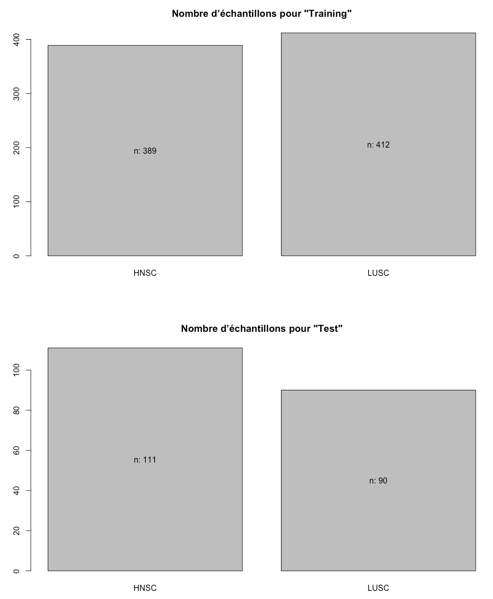

<style type="text/css">
/*https://stackoverflow.com/questions/38367392/override-rmarkdown-theme-in-order-to-change-html-page-width/38373846*/
body .main-container {
  max-width: 1100px !important;
  width: 1100px !important;
}
body {
  margin: auto;
  max-width: 1100px !important;
}
</style>
# Classification par apprentissage automatique du type de cancer à partir de données d'expression génétique de séquençage RNA-Seq

***

## Sur l'ordinateur personnel:

### But de la section: Prédiction avec les modèles entrainé fitsvmLinear_VST et fitrf_VST avec les jeux de données Test et Normale.


```
testDataset.df_VST <-readRDS("testDataset_df_VST_Normal.rds")
fitsvmLinear_VST <- readRDS("fitsvmLinear.rds")
fitrf_VST  <- readRDS("fitrf.rds")
```




```r
print(dim(testDataset.df_VST))
kable(testDataset.df_VST [43:53,1:6],"rst")
```
```
print(dim(testDataset.df_VST))
[1]   201 11062

kable(testDataset.df_VST [43:53,1:6],"rst")


============================  ====  ==================  ==================  ==================  ==================  ==================
\                             Type  ENSG00000000003.13  ENSG00000000419.11  ENSG00000000457.12  ENSG00000000460.15  ENSG00000000938.11
============================  ====  ==================  ==================  ==================  ==================  ==================
HNSC.CV.6959.01A.11R.1915.07  HNSC             9.80056           11.043547            8.705865            9.189783            9.459919
HNSC.CV.7415.01A.11R.2081.07  HNSC            10.59721           10.644880            8.525398            8.133543            8.707573
HNSC.CV.7407.01A.11R.2081.07  HNSC            10.41610           10.160302           10.085017           10.142132            9.643313
HNSC.UF.A7J9.01A.12R.A34R.07  HNSC            10.78716           10.951942            8.982523            9.340772            9.099182
HNSC.CN.A63W.01A.11R.A30B.07  HNSC            10.90019           11.404775            9.198699            8.631291            7.636378
HNSC.BA.5557.01A.01R.1514.07  HNSC            10.67046           10.896745            8.960470            8.240411           12.008264
HNSC.BA.6869.01A.11R.1873.07  HNSC            11.38521           10.874937            8.914856            8.525548            7.969842
HNSC.UF.A7JH.01A.21R.A34R.07  HNSC            11.16086           11.083761            9.714146            9.564517            9.122768
HNSC.MT.A67A.01A.11R.A30B.07  HNSC            10.55457           11.689214            9.237489            8.203214            8.721378
HNSC.D6.A6EM.01A.21R.A31N.07  HNSC            10.43486           11.705890            8.683907            9.806529            8.970645
HNSC.CN.5360.01A.01R.1436.07  HNSC            10.13117            9.655543            9.931549            8.932524           10.058532
============================  ====  ==================  ==================  ==================  ==================  ==================
```

### Pred avec SVM


```r
dim(testDataset.df_VST) 
dim(testDataset.df_VST[,-1]) # Remove the Type colunm from TestDataset
kable(testDataset.df_VST[,-1] [43:53,1:6],"rst")
```


```r
predictions <- predict(fitsvmLinear_VST, testDataset.df_VST[,-1])
confusionMatrix(predictions, testDataset.df_VST$Type)
```
```
Confusion Matrix and Statistics

          Reference
Prediction HNSC LUSC
      HNSC  108    0
      LUSC    3   90
                                         
               Accuracy : 0.9851         
                 95% CI : (0.957, 0.9969)
    No Information Rate : 0.5522         
    P-Value [Acc > NIR] : <2e-16         
                                         
                  Kappa : 0.9699         
                                         
 Mcnemar's Test P-Value : 0.2482         
                                         
            Sensitivity : 0.9730         
            Specificity : 1.0000         
         Pos Pred Value : 1.0000         
         Neg Pred Value : 0.9677         
             Prevalence : 0.5522         
         Detection Rate : 0.5373         
   Detection Prevalence : 0.5373         
      Balanced Accuracy : 0.9865         
                                         
       'Positive' Class : HNSC
```


### Pred avec RF


```r
dim(testDataset.df_VST)
dim(testDataset.df_VST[,-1]) # Remove the Type colunm from TestDataset

predictions <- predict(fitrf_VST, testDataset.df_VST[,-1])
0
(predictions, testDataset.df_VST$Type)
```
```
Confusion Matrix and Statistics

          Reference
Prediction HNSC LUSC
      HNSC   94    3
      LUSC   17   87
                                          
               Accuracy : 0.9005          
                 95% CI : (0.8505, 0.9382)
    No Information Rate : 0.5522          
    P-Value [Acc > NIR] : < 2e-16         
                                          
                  Kappa : 0.8017          
                                          
 Mcnemar's Test P-Value : 0.00365         
                                          
            Sensitivity : 0.8468          
            Specificity : 0.9667          
         Pos Pred Value : 0.9691          
         Neg Pred Value : 0.8365          
             Prevalence : 0.5522          
         Detection Rate : 0.4677          
   Detection Prevalence : 0.4826          
      Balanced Accuracy : 0.9068          
                                          
       'Positive' Class : HNSC  

```


```r
#Prediect with Normal

fitsvmLinear <- readRDS("fitsvmLinear.rds")
normalDataset.df_VST  <- readRDS("NormalDataset_df_VST_Normal.rds")

dim(normalDataset.df )
kable(normalDataset.df  [43:53,1:6],"rst")
normalDataset.df  <- normalDataset.df [,-1] # Remove the Type colunm from TestDataset
dim(normalDataset.df )
kable(normalDataset.df  [43:53,1:6],"rst")

TrainCols <- colnames(fitsvmLinear_VST$trainingData)[-1] # Colnames of model and remove first value "Outcome"
NormalCols <- colnames(normalDataset.df) # Colnames of dataset

NormalNotInTrain <- subset(TrainCols, !(TrainCols %in% NormalCols))  
#TrainNotInCols2Normal <- subset(NormalCols, !(NormalCols %in% TrainCols))

normalDataset.df[NormalNotInTrain] <- 0 # Create Missing Columns and put value to 0

predictions <- predict(fitsvmLinear_VST, newdata=normalDataset.df)
normalDataset.df <-readRDS("NormalDataset_df_VST_Normal.rds") # reload to get Type Colunm back
confusionMatrix(predictions, normalDataset.df$Type)

predictions <- predict(fitrf_VST, newdata=normalDataset.df)
normalDataset.df <-readRDS("NormalDataset_df_VST_Normal.rds") # reload to get Type Colunm back
confusionMatrix(predictions, normalDataset.df$Type)
```
